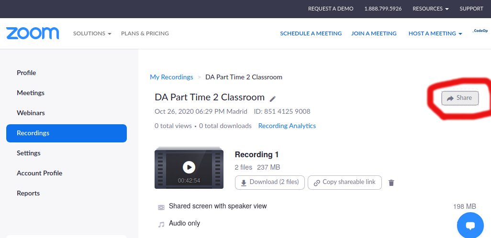

# UploadClass

This app interacts with Zoom, the Youtube API and the slack API in order to download videos from Zoom, upload them to Youtube and insert them in a playlist, and annouce on Slack when the video is available.

It was originally created for uploading the classes into a Youtube cohort playlist.

## Configure

The configuration of the API client is set on file `/src/uploadClass/client_secrets.json`:

```
{
  "web": {
    "client_id": [[your client_id]],
    "client_secret": [[your secret]],
    "redirect_uris": [],
    "auth_uri": "https://accounts.google.com/o/oauth2/auth",
    "token_uri": "https://accounts.google.com/o/oauth2/token"
  }
}
```

`client_id` and `client_secret` should reflect the id and secrets of the Oauth2.0 authentication of your youtube appliprojectcation.

Read [here](https://developers.google.com/youtube/registering_an_application) to understand how-to obtain authorization credentials on YouTube.  

The configuration of the video is set on file `and /src/uploadClass/config.in`:

```
[video]
keywords=FSD, full-time, cohort8
playlist_id=PL166HWJqwomYGSkUuEz4NpQWvLNlzlpiB
description=Class from the CodeOp FSD bootcamp
[slack]
channel=#general
token=[Oauth Access Token]
```
Please note that there are no quotes or commas, enclosing or separating the values in the configuration file!

The keywords, and description set the keywords and description to be associated with the video you want to upload.

The playlist_id is the id of the playlist, where you want to insert your video (you can grab it from the playlist url!)

## Slack webhook

This application was updated to post a notification message on a slack channel, informing that the video was uploaded.
In order to enable this feature, you need to install an app on slack, and to enable incoming webhooks. You also need to enable oauth authentication. You can read [here](https://api.slack.com/messaging/webhooks), more about how to use slack webhooks.
After you setup this, please copy your slack token to the slack section of the `config.ini` file, under the `token` entry.
The `channel` entry, sets the slack channel where you want to receive the notifications.

## Download Videos

This script uses a [third party-application](https://github.com/Battleman/zoomdl), to download videos from the zoom cloud. In order to download the videos, you will need their *shareable link*. 


Log in to zoom, and find the url of your recording, by clicking on the recording and selecting *Copy shareable link*:




## Install

Using Python2.x:

```
cd src/uploadClass
python setup.py install
```

If you don't have python installed, you can use it whithin a docker container. To build the container, from the root folder:

```
docker build -t uploadclass .
```

## RUN

With Python:

```
python2 upload_video.py --path="/tmp/zoom1" \
                        --url="https://us02web.zoom.us/rec/share/84tHBvQBDYYDpaeCZpm1VlDPX8ttlGcK9i8mJ6STxLyzI2ApMiew_P58PcYkXc2S.p4n3u2mbug9BpcIE?startTime=1611597121000" \
                       --title="Looping through objects" 
```

The `path` argument should contain the path and filename where you want to store temporarily the download, **without the extension**.
The `url` argument should contain the zoom shareable link. 

With docker:

```
docker run  -v /tmp:/movies uploadclass --path="/movies/zoom1" --url="https://us02web.zoom.us/rec/share/84tHBvQBDYYDpaeCZpm1VlDPX8ttlGcK9i8mJ6STxLyzI2ApMiew_P58PcYkXc2S.p4n3u2mbug9BpcIE?startTime=1611597121000" --title="Looping through objects"
```

When passing the video to the container, pay attention to two things:
- On mapping volume path `/tmp:/movies uploadclass`, you need to replace the `tmp` bit, by whatever path you have your video store whithin.
- On the file path, `/movies/zoom`, you need to replace the filename to match the name of your video, but **leave the `/movies/` bit on**.


## TODOS

- Mount the configuration files in the container, so that we don't have to build the image, every time.
- Read the OAuth credentials from environmental variables (and inject those into the container)
